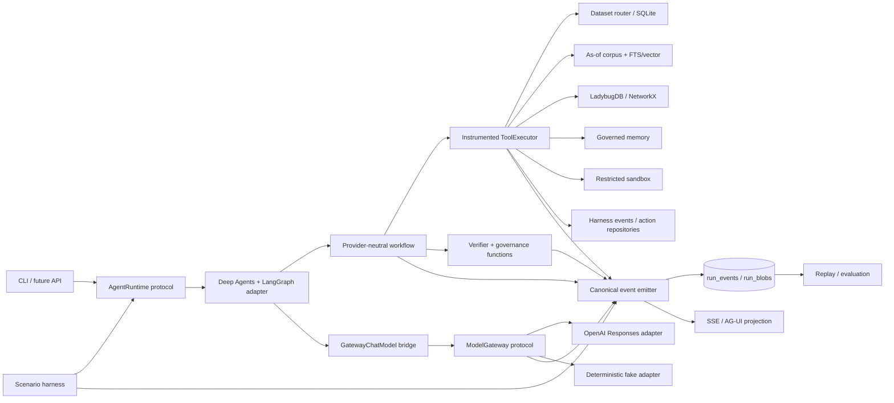
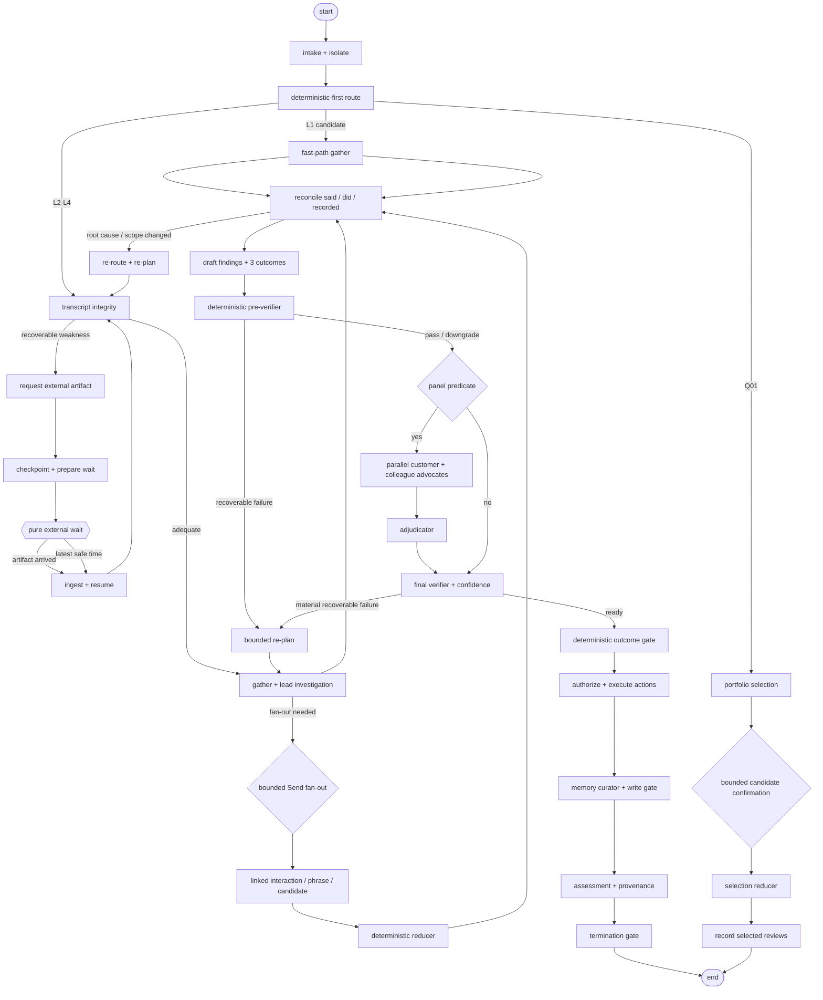
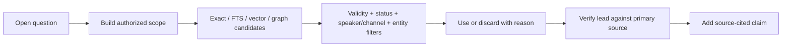
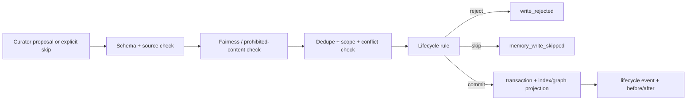

# ConductAI agent architecture

**Status:** Stage 3 implementation blueprint  
**Date:** 15 September 2026  
**Research basis:** [04-agent-architecture-research.md](04-agent-architecture-research.md)  
**Initial runtime:** Deep Agents + LangGraph  
**Default model:** OpenAI `gpt-5.6-luna` through the Responses API

## 1. Architecture decision

ConductAI is a deterministic, event-sourced compliance workflow containing a bounded agentic investigation loop. LangGraph implements the first workflow runtime and Deep Agents implements the lead reviewer and registered specialists. Neither framework owns conduct policy, authorization, memory semantics, tools, outcomes, or the audit record.

Five rules define the boundary:

1. **Code owns regulated control.** Routing precedence, evidence visibility, as-of selection, calculations, panel predicates, confidence, the 0.75 threshold, allowed actions, memory gates, budgets, and termination are deterministic functions.
2. **Agents own bounded inquiry.** The lead chooses which admissible evidence to pursue, which hypothesis to test next, and whether another permitted action can change an outcome.
3. **Domain records cross boundaries, never framework objects.** OpenAI, LangChain, LangGraph, and Deep Agents types remain inside adapters.
4. **Every effect crosses one instrumented boundary.** Nodes, models, tools, stores, sandbox jobs, waits, governance checks, and actions cannot execute without canonical events.
5. **There is no human path.** Runs suspend only for harness-controlled external events and reach an automated decision by the latest safe decision time.

The graph decides *which obligations exist*; agents decide *how to investigate unresolved obligations*; deterministic governance decides *what may be concluded and executed*.

### 1.1 System view



### 1.2 Dependency rule

Dependencies point inward:

```text
api / cli / harness
        ↓
runtime adapters ── model adapters
        ↓
application graph / tool executor / event emitter
        ↓
domain state / findings / governance / provenance
        ↑
data, corpus, memory, graph, action implementations
```

`src/conductai/domain` imports only the standard library and Pydantic. Provider SDKs occur only under `adapters/models`; Deep Agents, LangChain, and LangGraph only under `adapters/runtime`. Architecture tests enforce these restrictions.

## 2. Package and configuration layout

```text
config/
  models.yaml
  routes.yaml
  governance.yaml
  agents/*.yaml
  scenarios/*.yaml
skills/<skill>/SKILL.md
src/conductai/
  domain/          # state, evidence, findings, outcomes, provenance, enums
  data/            # manifest-driven views, SQL templates, availability gates
  tools/           # registry, executor, typed read/request/action tools
  memory/          # persistent, hybrid, graph, lifecycle/write gate
  runtime/         # provider-neutral graph nodes and runtime protocols
  adapters/
    models/        # OpenAI Responses, fake, GatewayChatModel bridge
    runtime/       # Deep Agents/LangGraph, fake/replay
    graph/         # LadybugDB and NetworkX
  harness/         # scenarios, virtual clock, artifacts, personas, scheduler
  observability/   # envelope, event union, emitter, blobs, projections, replay
  evaluation/      # isolated labels, deterministic and trajectory scoring
  api/             # later FastAPI/SSE transport
tests/
  architecture/ contract/ unit/ integration/ trajectories/
```

Registries are immutable after startup and their content hashes are included in the resolved run snapshot. Startup rejects duplicate IDs, unresolved references, invalid route fields, unknown permissions, missing skills, schema conflicts, or mutable skill/corpus sources.

The data layer resolves a scenario's `dataset_root` and `manifest.json`; domain code never assumes the current counts or filenames. The initial local stack pins Deep Agents 0.7.x, compatible LangGraph/LangChain packages, Pydantic, `sqlite-vec`, `ladybug`, and NetworkX. Lockfile upgrades require contract and trajectory evaluation.

## 3. Authoritative review state

`ReviewState` is the checkpointed LangGraph state. Reducer annotations are explicit rather than inferred:

```python
class ReviewState(BaseModel):
    run_id: str
    review_id: str
    scenario_id: str
    virtual_now: datetime
    latest_safe_decision: datetime
    trigger: Trigger
    route: RouteDecision | None = None
    budgets: BudgetState
    review_file: ReviewFile
    integrity: dict[str, TranscriptIntegrity]
    retrieved_sources: dict[str, SourceRecord]
    branch_results: Annotated[list[BranchResult], deterministic_branch_merge]
    verifier_checks: dict[str, VerifierCheck]
    panel: PanelState | None = None
    proposed_assessment: AssessmentRecord | None = None
    authorized_actions: list[AuthorizedAction]
    waits: dict[str, WaitState]
    checkpoints: list[str]
    progress_fingerprint: str | None = None
    no_progress_count: int = 0
    replan_count: int = 0
    termination: Termination | None = None
```

`ReviewFile` is the runtime-neutral blackboard projected into Deep Agents at `/review/<review_id>/`:

- `plan.json`: ordered obligations, next action, completion status, and expected decision impact;
- `claims.json`: atomic claims with source IDs, exact spans, trust class, and verification state;
- `evidence_matrix.json`: said/did/recorded/policy columns and support/contradiction links;
- `hypotheses.json`: competing explanations, evidence for/against, status, and flip fact;
- `open_questions.json`: decision-changing questions, admissible next actions, and value of information;
- `deadlines.json`: monitoring SLA, expected arrivals, latest safe time, and scheduled follow-ups.

The blackboard is a projection, not an alternative store. Every mutation is a typed state update plus `review_file_updated`; specialists return typed patches and cannot write shared state directly. Parallel reducers sort by `(branch_kind, subject_id, branch_id)`, reject conflicting ownership, deduplicate source refs, and emit the merge result.

Assessment fields are never accepted as prose-only. Each leaf has `value`, `source_refs`, and `event_seqs`; all source IDs must have been visible at the cited sequence.

## 4. Graph

### 4.1 Main graph



### 4.2 Node ownership and checkpoints

| Node | Owner | Effects and output | Checkpoint after |
|---|---|---|---:|
| `intake` | code | create run, secret-free snapshot, data projection, SLA | yes |
| `route` | code + optional classifier | typed route, budget, roles, skills | yes |
| `fast_path_gather` | code/lead if needed | minimum decisive records | no |
| `integrity` | code + integrity specialist | quality findings and artifact need | yes if request |
| `request_artifact` | tool executor | idempotent request/outbox row | yes |
| `wait_external` | harness | no pre-wait side effects; suspend/resume only | inherent |
| `gather` | lead Deep Agent | plan, typed tool/specialist requests, patches | each iteration |
| `fanout/reduce` | dispatcher/code | isolated branches and deterministic merge | after merge |
| `reconcile` | code + records specialist | clock-corrected evidence matrix | yes |
| `reroute/replan` | code + lead | bounded plan/route patch tied to new fact | yes |
| `preverify` | code | exact spans, citations, dates, calculations, fairness | yes |
| `panel` | specialists + code | frozen snapshot, positions, adjudication | after freeze/result |
| `final_verify` | code + verifier | checks and computed confidence inputs | yes |
| `decide` | code | three gated outcomes, conservative default | yes |
| `action` | code/tool executor | re-authorized idempotent effects | each effect |
| `memory` | curator + code | skip/reject/write/lifecycle operations | yes |
| `record` | code | provenance-complete assessment and customer letter | yes |
| `termination` | code | one closed-enum stop reason | terminal |

The agent never chooses whether mandatory integrity, verifier, governance, action-authorization, memory, provenance, or termination nodes execute.

### 4.3 Loop, edge, and fan-out rules

One investigation iteration may make one primary evidence action and bounded supporting reads. It must state the open question, expected outcome impact, and stop condition. A progress fingerprint hashes newly verified source IDs, changed hypotheses, resolved questions, and verifier failures. An unchanged fingerprint increments no-progress; two unchanged iterations stop or downgrade.

Back-edges are permitted only when:

- `reconcile → reroute` has a typed root-cause or scope change;
- `verify → replan` identifies a recoverable, outcome-changing failed check;
- `resume → integrity` adds or definitively fails to add the requested artifact.

Each route sets `max_replans` (L1 0, L2 1, L3 2, L4 3). A specific verifier check may trigger at most one re-plan unless a new external artifact changes its evidence.

`FanOutDispatcher` handles three initial shapes:

- C11: at most 24 enrollment interactions, one linked-interaction branch each;
- C12: at most 40 semantically retrieved phrase hits, then at most 24 evidence branches;
- Q01: deterministic scoring for the whole eligible week, with at most 64 model confirmations for genuinely ambiguous feature extraction.

Branches receive the minimum case slice, read-only tools, one relevant skill, no durable writes, and a fixed result schema. The dispatcher enforces global/per-run concurrency, per-branch budgets, cancellation, and stable merge ordering. No asynchronous hosted subagent control plane is used.

### 4.4 Suspend and resume protocol

Suspension is allowed only for re-transcription, audio recovery, colleague statement, simulated customer reply, or scheduled follow-up. `prepare_wait` requires an idempotency key, expected availability, the monitoring SLA, and a computed latest safe decision time. It commits the request and checkpoint before entering the pure wait node.

The harness advances the virtual clock to the earlier of an allowed arrival and latest safe time. Resume always enters through artifact ingestion and records checkpoint restoration. If the artifact cannot arrive in time, the run resumes at the deadline and treats absence only as evidence unavailability. It never infers misconduct or consent from non-response.

## 5. Router

### 5.1 Deterministic-first algorithm

1. Build a permitted projection from trigger and visible records.
2. Evaluate enabled rules by ascending priority; first complete match wins.
3. A rule assigns track, channel, language workflow, depth, graph path, budget, skills, and mandatory roles.
4. If no complete rule matches, call a structured classifier over enumerated registered routes.
5. Accept it only at confidence `>= 0.80` and when deterministic invariants agree.
6. Otherwise use `mixed_ambiguous_l4`, restricted actions, full verifier, and panel eligibility.
7. Record every evaluated rule/candidate and the features used; prohibited features never enter the projection.

The operational 0.80 route threshold is distinct from the statutory-policy 0.75 adverse-colleague threshold. Language and ASR metadata select evidence handling only, never risk, severity, colleague fault, or Q01 ranking.

### 5.2 Configuration schema

```yaml
schema_version: 1
defaults:
  classifier_threshold: 0.80
  fallback_route: mixed_ambiguous_l4
routes:
  - id: cli_soft_pull_clean
    priority: 10
    match:
      all:
        - {field: trigger.type, op: in, value: [scanner_flag, random_slice]}
        - {fact: credit_line_request_present, op: eq, value: true}
        - {fact: inquiry_type, op: eq, value: SOFT}
    output:
      track: sales
      depth: L1
      path: fast_clean
      budget: {tool_calls: 8, model_input_tokens: 30000, wall_seconds: 90, replans: 0}
      roles: [lead_conduct_reviewer]
      skills: [credit-line-increase]

  - id: mixed_ambiguous_l4
    priority: 10000
    match: {fallback: true}
    output:
      track: mixed
      depth: L4
      path: full_investigation
      action_profile: restricted_ambiguous
      roles: [lead_conduct_reviewer, policy_analyst, verifier]
      skills: []
```

Operators and facts come from registered, tested sets; YAML cannot execute code. Startup rejects unknown fields, routes, paths, roles, skills, actions, or budgets.

### 5.3 Route families

| Route | Signals | Typical depth | Roles / skills |
|---|---|---:|---|
| `cli_assurance` | CLI plus inquiry/assurance language | L1-L4 | policy/records; credit-line-increase |
| `callback_sale` | outbound sale plus callback candidate | L2 | lead, graph/records |
| `addon_consent` | add-on offer/enrollment/complaint | L2-L4 | integrity, pattern, remediation; add-on-consent |
| `balance_transfer_disclosure` | BT offer/submission | L3 | policy/records; balance-transfer-disclosure |
| `product_change` | close/fee call plus product change | L4 | records/remediation/panel; product-change |
| `conditioned_servicing` | waiver or servicing outcome near sale | L2/L3 | records/policy |
| `hardship_vulnerability` | permitted protected-situation flags or in-interaction indicators | L3/L4 | remediation/panel; hardship-and-vulnerability |
| `military_rights` | mention of orders/deployment/service | L3 | policy/remediation; scra |
| `multilingual_quality` | bilingual queue or language-model mismatch | L3 | integrity; multilingual-review |
| `complaint_handling` | dissatisfaction or complaint record mismatch | L2/L3 | records; complaints |
| `retention_cancellation` | close/cancel requests and retention offer | L3 | remediation; retention |
| `preference_suppression` | opt-out and later solicitation | L3 | graph/records/remediation |
| `disclosure_clarity` | disclosure-required event and pace concern | L3 | integrity/records + sandbox |
| `mixed_ambiguous_l4` | incomplete/low-confidence route | L4 | lead, relevant specialists, verifier |
| `weekly_selection` | Q01 scenario | meta | deterministic rank + protected random slice |

Channel is an orthogonal route dimension (`phone`, `chat`, `secure_message`). Language workflow is `english`, `spanish`, or `code_switched`; it changes transcription/retrieval resources but not substantive criteria.

### 5.4 Q01 portfolio route

Q01 first filters to the configured week and visible eligible interactions. A registered sandbox helper computes risk scores using only CRM-001@v5 permitted signals: sale/enrollment, outbound sale, early cancellation, complaint within seven days, recording gap, protected-situation flags, scanner flags, and prior substantiated findings within 90 days. Ten percent of capacity is a seeded, stratified random slice by channel using seed `20261116`; those slots cannot be displaced by risk rank. The remaining slots take stable descending score order with interaction ID as tie-breaker.

Every candidate records feature contributions, exclusions, stratum, random draw if applicable, rank, and selection reason. Age, language, accent, ASR confidence, site, and demographics are unavailable to the scorer. The model may confirm a bounded ambiguous input but cannot change computed scores or the random draw.

## 6. Agent and subagent registry

All roles initially resolve to the same default model. An override surface exists but remains empty until evaluation supports tiering.

| Role ID | Typed output / boundary | Tools | Invoked when |
|---|---|---|---|
| `lead_conduct_reviewer` | plan, next action, hypotheses, proposed findings; no actions | route-scoped reads, compute, artifact request, `task` | every nontrivial review |
| `transcript_integrity_analyst` | decisive-span quality and recovery recommendation | transcript/channel/gap reads, artifact request | low confidence, gap, language or speaker conflict |
| `desktop_records_reconciler` | clock-corrected said/did/recorded matrix | event/record reads, compute | speech and system state may differ |
| `policy_analyst` | as-of clauses, conflicts, precedence; no case verdict | corpus/precedent retrieval | version/product/rule issue |
| `linked_interaction_reviewer` | one interaction's verified evidence only | scoped transcript/records/corpus | C11/C12/Q01 fan-out |
| `population_pattern_analyst` | scoped counts/paths and graph-write proposal | graph, registered SQL, compute | possible colleague/system/material population |
| `remediation_planner` | reversible customer-safe action proposal | outcome records, customer outreach request | harm or customer choice |
| `customer_advocate` | frozen-snapshot position | no live tools | panel only |
| `colleague_advocate` | frozen-snapshot defense/attribution position | no live tools | panel only |
| `adjudicator` | determinative issue, result, flip fact | frozen file + positions only | panel only |
| `verifier` | typed judgmental checks; never confidence number | read/compute, no effects | L3/L4 and panel results |
| `memory_curator` | skip/write/lifecycle proposal | memory candidates/search only | end of selected reviews/offline job |

This is a registry of twelve roles, not twelve invocations. L1 normally uses zero or one model role; L2 at most the lead and one investigation specialist; L3 uses relevant specialists; L4 permits bounded fan-out and governance roles. Advocates receive the identical frozen redacted snapshot and cannot observe each other. The adjudicator cannot gather new evidence. No role grants itself tools, skills, budgets, or scope.

Example agent entry:

```yaml
id: transcript_integrity_analyst
version: 1
prompt_path: prompts/transcript_integrity_analyst.md
model_role: default
tools: [get_transcript, get_channel_metadata, request_artifact]
skills: [multilingual-review]
response_schema: TranscriptIntegrityReport
max_iterations: 3
permissions:
  scopes: [current_review, current_interactions]
  effects: [request_retranscription, request_audio_recovery]
```

## 7. Skills

The eleven authored playbooks become drop-in `skills/<name>/SKILL.md` directories with `name`, `description`, `version`, and route metadata. Their procedural sequence, required checks, stop rules, and output expectations remain authoritative.

| Skill | Principal routes / cases |
|---|---|
| `add-on-consent` | C01, C11/C11b, C12, C16 |
| `automated-adjudication` | every panel |
| `balance-transfer-disclosure` | C05 |
| `complaints` | C13 |
| `credit-line-increase` | C03/C04 |
| `hardship-and-vulnerability` | C08/C14 |
| `memory-hygiene` | C04, C11/C11b, C12, C14, C19 and curator |
| `multilingual-review` | C10 |
| `product-change` | C06 |
| `retention` | C17 |
| `scra` | C09 |

Route selection supplies only a skill index; full content loads progressively when needed. `skill_loaded` records name, version, hash, path, reason, actor, and span. Duplicate names, writable sources, invalid front matter, or mid-run hash changes fail closed. Deep Agents is constructed without human approval interrupts.

## 8. Model gateway and runtime boundaries

### 8.1 Neutral model contract

```python
class ModelGateway(Protocol):
    @property
    def capabilities(self) -> ModelCapabilities: ...

    async def stream(
        self, request: ModelRequest, *, cancellation: CancellationToken
    ) -> AsyncIterator[ModelStreamEvent]: ...
```

`ModelRequest` contains provider-neutral messages with typed trusted/untrusted content blocks, JSON-schema tools, optional structured-output schema, reasoning/latency budgets, metadata, and idempotency key. Normalized events cover text delta, tool-call delta/final, structured-output final, usage, completion, and classified error. The final response retains normalized content, usage including cached/reasoning tokens, latency, provider request ID, and redacted opaque provider metadata.

`GatewayChatModel` is a narrow LangChain bridge inside the runtime adapter. It translates framework messages and tools to/from the neutral contract. Domain and tool modules never import it.

### 8.2 Neutral agent-runtime contract

```python
class AgentRuntime(Protocol):
    async def start(self, request: RunRequest) -> RunHandle: ...
    async def run_or_stream(self, handle: RunHandle) -> AsyncIterator[RuntimeEvent]: ...
    async def resume(self, run_id: str, resume: ResumeInput) -> RunHandle: ...
    async def cancel(self, run_id: str, reason: str) -> None: ...
```

The initial adapter maps this to the compiled graph, SQLite checkpointer, Deep Agents roles, and typed/raw streams. A future Codex SDK adapter maps run handles to threads and items while calling the same tools/governance and emitting the same events. It is documented, not implemented in Stage 4 unless justified.

### 8.3 Resolved configuration

```yaml
schema_version: 1
provider: openai
api: responses
default:
  model: gpt-5.6-luna
  reasoning_effort: medium
  timeout_seconds: 60
  max_attempts: 3
  max_output_tokens: 12000
  required_capabilities:
    - structured_output
    - tool_calling
    - streaming
    - reasoning_controls
    - usage_reporting
    - prompt_caching
role_overrides: {}
concurrency: {model_calls: 8, per_run: 4}
retry: {initial_backoff_ms: 500, max_backoff_ms: 8000, jitter: full}
```

Environment overrides use `CONDUCTAI_MODEL__...`; only the OpenAI adapter reads `OPENAI_API_KEY`. Startup resolves once to a secret-free immutable snapshot and hash attached to the run and each call. It validates required capabilities and never silently changes model/provider. Authentication, permission, validation, and unsupported-capability failures are terminal; eligible timeouts, rate limits, and 5xx errors use bounded instrumented retry. Actions are retried only with idempotency and read-after-write reconciliation.

The model alias, adapter/package versions, and pricing-table version are recorded because no date-stamped Luna snapshot is currently documented. Fake and recorded-output adapters implement the same contract.

## 9. Tool catalog

Every tool is registered with name, version, Pydantic argument/result schemas, trust class, read/effect designation, allowed actors, scopes, and idempotency requirements. The generated model schema always requires a short `rationale`. `ToolExecutor` validates the proposal, re-authorizes actor/route/review/target, emits the call, runs the implementation, validates and redacts the result, blobs large content, and emits the result. Arbitrary model-authored SQL or Cypher never reaches an operational store.

### 9.1 Read and retrieval tools

| Tool | Argument schema | Result and guard |
|---|---|---|
| `get_review_context` | `review_id, as_of` | trigger/interaction refs; evaluator fields removed |
| `get_interaction` | `interaction_id, as_of` | channel, timing, participants; prohibited projections removed |
| `get_transcript` | `interaction_id, turn_ids?, speaker?, channel?, include_words, as_of` | source-preserving untrusted turns/words and quality metadata |
| `get_channel_metadata` | `interaction_id, from_s?, to_s?` | channel/speaker confidence and recording gaps |
| `get_desktop_events` | `interaction_id, event_types?, from_at?, to_at?, as_of` | local clock, zone, offset, source IDs |
| `get_records` | `entity, interaction_ids?, account_id?, colleague_id?, from_at?, to_at?, as_of, limit<=500` | allowed table projection with availability gate |
| `run_registered_query` | `query_id, parameters, as_of, row_limit<=1000` | registered SQL only; expanded template logged |
| `retrieve_corpus` | `query, governing_date, governing_date_rule, families?, product?, top_k<=20` | FTS/vector candidates prefiltered by validity/status |
| `search_transcripts` | `query, speaker?, channel?, colleague_id?, from_at?, to_at?, top_k<=40` | hybrid hits with exact spans; scope authorization |
| `search_precedents` | `query, as_of, category?, top_k<=20` | candidates with dates, policy versions, flaw warnings |
| `search_memory` | `query, namespace, entity_ids?, scope, as_of, status=[active], min_confidence?, top_k` | eligible candidates only; memories remain leads |
| `query_graph` | `template_id, parameters, as_of, max_hops<=4, limit<=250` | registered Cypher/query templates and source-bearing paths |
| `get_action_status` | `idempotency_key` | before/after and committed/unknown/failed state |

All reads require `as_of`; records with `available_at > virtual_now` are invisible. Retrieval logs all candidate IDs and scores, then a separate use/discard event records the decision and verification.

### 9.2 External-event tools

| Tool | Arguments | Guard |
|---|---|---|
| `request_artifact` | `review_id, interaction_id, kind, respond_by, rationale, idempotency_key` | allow-listed re-transcription/audio/statement; latest-safe check |
| `message_customer` | `review_id, customer_id, question, response_schema, respond_by, rationale, idempotency_key` | one decision-changing question; no prohibited-data request |
| `schedule_follow_up` | `review_id, at, action_type, rationale, idempotency_key` | authorized type and deadline |
| `acknowledge_artifact` | `review_id, artifact_id` | ingestion only; release is harness-owned |

Customer non-response and colleague non-response never count as adverse evidence.

### 9.3 Computation tool

```python
class ComputeArgs(BaseModel):
    helper: Literal[
        "business_days", "latest_safe_decision", "align_desktop_clock",
        "words_per_minute", "fee_amount", "premium_refund", "rewards_value",
        "timezone_order", "cancellation_rate", "population_count",
        "q01_score", "seeded_stratified_sample", "python_analysis"
    ]
    inputs: dict[str, JsonValue]
    code: str | None = None
    rationale: str
```

Named helpers port tested behavior from `data/generator/derived.py` and are mandatory for safety-critical arithmetic. `python_analysis` receives only bounded JSON from prior authorized reads and runs AST-validated code in an isolated worker: empty environment, no credentials/network/repository mount, temporary directory, import allow-list, no file/process/socket/reflection/dynamic import, and CPU/wall/memory/source/output limits. Code, inputs, stdout/stderr, value, timing, and errors are recorded. The local worker is a POC containment control, not a production hostile-code boundary.

### 9.4 Action tools

```python
class ExecuteActionArgs(BaseModel):
    review_id: str
    action: ActionUnion
    decision_event_id: str
    authorization_check_ids: list[str]
    idempotency_key: str
```

`ActionUnion` permits only the CRM-003@v4 list: customer remediation and outreach, complaint/SCRA records, bounded colleague records/coaching/monitoring, lookbacks/control records/script/scanner/material actions, and governed memory/graph operations. Each action implementation checks the final assessment, route, target, amount/population evidence, customer-confirmation requirement, authorization events, and previous status. Employment/disciplinary/compensation actions, bank-initiated closures/restrictions, authorized-inquiry deletion, regulator/third-party contact, and prohibited-basis actions have no schema variant and are denied again by policy.

### 9.5 Memory tools

| Tool | Arguments | Result |
|---|---|---|
| `propose_memory_operation` | discriminated `skip/write/supersede/retract/consolidate/expire/purge`, scope, validity, confidence, refs, rationale | gate results and candidate diff |
| `commit_memory_operation` | proposal ID, verifier event IDs, idempotency key | lifecycle row, tombstone/projection IDs |
| `propose_graph_write` | node/edge type, subject, validity, evidence refs, rationale | scope/fairness/dedupe checks |
| `commit_graph_write` | proposal ID, verifier IDs, idempotency key | graph projection and persistent source row |

Agents only propose. Deterministic write gates commit in the memory node. `skip` and rejection are durable outcomes.

## 10. Memory and retrieval

### 10.1 Three planes and working memory

| Plane | Initial implementation | Authority |
|---|---|---|
| persistent | SQLite + FTS5 + SQLite LangGraph checkpointer | exact records, review/event/action/note lifecycle state |
| semantic | sqlite-vec plus FTS5 | ranked candidates across corpus/transcripts/precedents/notes/comms |
| graph | LadybugDB embedded Cypher; NetworkX fallback | bounded multi-hop relationships and projections |
| working | typed `ReviewFile` in checkpointed state | current plan/claims/hypotheses, never primary evidence |

`sqlite-vec` metadata filters and exact SQL validity/status restrictions apply before ranking. Graph writes originate in persistent source rows and are projected transactionally; the projection is rebuildable. A fallback from LadybugDB to NetworkX requires startup probe failure, an explicit `fallback` event, identical contract tests, and a run-snapshot flag. It is never silent.

### 10.2 Selective read flow



Scope includes review, interaction/account/customer/colleague, product, track, speaker/channel, governing date, virtual availability, validity window, lifecycle status, and minimum confidence. Superseded/retracted/archived/purged notes cannot appear as current. A colleague pattern can be retrieved only for that colleague. Team membership can locate common materials but cannot import a teammate's pattern. Every candidate and decision is logged.

### 10.3 Selective write and forgetting



Lifecycle semantics are bitemporal: `valid_from/valid_to` describe when a belief applies; `recorded_at/invalidated_at` describe when ConductAI held it. Operations are:

- `write`: durable, evidence-backed, scoped, time-bounded knowledge;
- `supersede`: governing source changed; preserve prior row and close valid time;
- `retract`: wrong from inception; preserve correction and record time;
- `consolidate`: at least three compatible observations into one sourced note and archive inputs;
- `expire`: TTL or validity ended;
- `purge`: prohibited content removed from active payload/index while a non-sensitive tombstone remains;
- `skip`: fact is case-local, duplicate, weak, prohibited, or not useful.

This directly handles MEM-0310/0320, MEM-0341–0343, MEM-0350–0356, MEM-0361–0365, MEM-0396, C11b's deliberate non-write, and C14's purge. Memory is always a lead to reverify, never evidence by itself. An offline curator runs the identical gate and event contract.

## 11. Harness and isolation

### 11.1 Data views

The scenario loader creates physically/logically separate capabilities:

- **agent view:** manifest-declared corpus and generated operational data with `is_hero` removed;
- **harness-private view:** personas and artifact release schedules;
- **evaluator-only view:** `ground_truth/**`, background labels, sweep answers, and capability requirements.

The data router denies `ground_truth/**`, `simulation/**`, direct `on_request/**`, raw dataset filesystem access, raw SQLite handles, and any field named `is_hero`. Simulation data is usable only through persona behavior; an artifact becomes agent-visible only after an idempotent request and harness release. The sandbox has no dataset mount. Denials produce `access_denied` and fail corrupt-success evaluation even if the answer is right.

### 11.2 Virtual clock and scheduler

Each run begins from the scenario clock. All repositories filter `available_at <= virtual_now`; wall time is diagnostic only. The scheduler releases requested artifacts, customer replies, colleague statements, and scheduled follow-ups in stable order, advances to the next event/deadline, and resumes the checkpoint. Business-day calculations use the tested holiday calendar. It cannot skip past latest safe decision.

### 11.3 Personas and external actors

The harness, not a conduct role, reads `simulation/customer_personas.json`. A persona state machine receives only the sent question and its scenario state, returns a bounded reply at its configured availability, and cannot inspect expected outcomes. Colleague statements and recovered evidence are immutable fixtures released through the same protocol. Future generative personas must use a separate recorded gateway and be evaluated for policy leakage.

### 11.4 Budgets

| Depth | Tool calls | Model input tokens | Wall target | Replans | Fan-out |
|---|---:|---:|---:|---:|---:|
| L1 | 8 | 30k | 90 s | 0 | 0 |
| L2 | 20 | 80k | 3 min | 1 | 0 |
| L3 | 45 | 180k | 7 min | 2 | 8 |
| L4 | 100 | 450k | 15 min | 3 | 24 |
| Q01 | 2,000 deterministic reads + 64 confirmations | 300k | 20 min | 0 | 64 |

These are initial POC values in route config, not policy. Waiting time is excluded from wall budget but not the SLA. Every update emits used/remaining. At exhaustion, the graph proceeds to verifier and safe outcome; it never silently truncates.

## 12. Canonical trajectory model

### 12.1 Event envelope

```json
{
  "schema_version": 1,
  "event_id": "EVT-01J...",
  "run_id": "RUN-...",
  "review_id": "REV-2026-90007",
  "seq": 42,
  "span_id": "SPN-...",
  "parent_span_id": "SPN-...",
  "branch_id": null,
  "checkpoint_id": "CP-...",
  "ts_wall": "2026-09-15T08:00:00Z",
  "ts_virtual": "2026-11-16T15:00:00Z",
  "actor": {"kind": "tool", "name": "retrieve_corpus"},
  "type": "retrieval",
  "summary": "Retrieved policy candidates governing the interaction date",
  "payload": {"query": "product change rewards disclosure", "as_of": "2026-10-28"},
  "refs": ["CLB-CHC-PC@v3"],
  "runtime": {"snapshot_hash": "sha256:...", "model": "gpt-5.6-luna"},
  "usage": null,
  "redactions": [],
  "prev_event_hash": "sha256:...",
  "event_hash": "sha256:..."
}
```

The event union is a Pydantic discriminated union exported as JSON Schema. `seq` is allocated transactionally per run. Hash input is canonical JSON of the envelope excluding `event_hash`. Branch order reflects actual persistence; deterministic merge events record semantic ordering.

### 12.2 Persistence and emitter

`run_events` stores the envelope plus indexed type/actor/span/ref columns. `run_blobs(hash, media_type, size, compressed, redacted_bytes)` stores large normalized prompts, results, snapshots, diffs, code, and outputs by SHA-256. Checkpoints are linked, not treated as the ledger.

The only public `emit()` performs schema validation, secret/PAN/SSN/prohibited-content redaction, blob extraction, transactional sequence allocation, previous-hash lookup, hash computation, insert, and subscriber publication. If persistence fails, the guarded effect does not run; if terminal-result emission fails after an external effect, status reconciliation occurs before retry. Redaction is irreversible in telemetry and replay artifacts.

### 12.3 Event catalog

The table enumerates the complete v1 event union. Examples show the minimum discriminating payload; all also carry the envelope. “Emitter” names the mandatory choke point and “view” the principal frontend consumer.

| Type | Example payload | Emitter | Frontend view |
|---|---|---|---|
| `run_started` | `{"scenario":"local","snapshot_hash":"sha256:…"}` | runtime | timeline |
| `node_entered` | `{"node":"integrity","state_hash":"…"}` | graph wrapper | workflow/span tree |
| `node_exited` | `{"node":"integrity","diff_blob":"sha256:…","status":"ok"}` | graph wrapper | workflow/time travel |
| `edge_taken` | `{"from":"verify","to":"replan","condition":"material_failure","value":true,"back_edge":true}` | condition wrapper | workflow |
| `checkpoint_saved` | `{"checkpoint_id":"CP-7","state_hash":"…"}` | checkpointer adapter | time travel |
| `checkpoint_restored` | `{"checkpoint_id":"CP-7","resume_reason":"artifact_arrived"}` | runtime | clock/time travel |
| `route_decision` | `{"candidates":["addon_consent"],"matched_rule":"r20","method":"rule","track":"sales","channel":"phone","language":"en","depth":"L2"}` | router | route/Q01 |
| `plan_created` | `{"steps":["verify decisive word","compare enrollment"]}` | lead middleware | plan |
| `plan_updated` | `{"reason_event_seq":81,"patch":[{"op":"add","path":"/steps/2","value":"inspect script"}]}` | lead middleware | plan/time travel |
| `todo_updated` | `{"item":"Q2","status":"resolved","source_refs":["ENR-…"]}` | review-file service | plan |
| `llm_call_started` | `{"attempt":1,"requested_model":"gpt-5.6-luna","request_blob":"sha256:…","tool_schema_hash":"…"}` | model gateway | model/cost |
| `llm_stream_event` | `{"kind":"text_delta","ordinal":4,"text":"…"}` | model gateway | live activity |
| `llm_call` | `{"provider_request_id":"resp_…","stop":"tool_call","response_blob":"sha256:…","usage":{"input":900,"output":120,"reasoning":80,"cached":400}}` | model gateway | model/cost |
| `llm_call_failed` | `{"attempt":1,"class":"rate_limit","retryable":true,"message":"redacted"}` | model gateway | failures |
| `retry` | `{"operation":"model_call","attempt":2,"delay_ms":800,"class":"rate_limit"}` | gateway/tool executor | failures |
| `agent_started` | `{"role":"lead_conduct_reviewer","skills":["add-on-consent"]}` | agent middleware | span tree |
| `agent_finished` | `{"role":"lead_conduct_reviewer","result_schema":"LeadPatch","status":"ok"}` | agent middleware | span tree |
| `subagent_started` | `{"role":"linked_interaction_reviewer","subject":"INT-…","brief_blob":"sha256:…"}` | dispatcher | branches |
| `subagent_finished` | `{"role":"linked_interaction_reviewer","subject":"INT-…","result_blob":"sha256:…","status":"ok"}` | dispatcher | branches |
| `fanout_started` | `{"kind":"linked_interaction","count":23,"cap":24}` | dispatcher | workflow/branches |
| `fanout_merged` | `{"branches":23,"ordering":"subject_id","result_hash":"…"}` | reducer | workflow/branches |
| `skill_loaded` | `{"skill":"add-on-consent","version":1,"hash":"sha256:…","reason":"route"}` | skill backend | plan/span tree |
| `tool_call` | `{"tool":"get_transcript","version":1,"rationale":"verify consent","args":{"interaction_id":"INT-…"},"authorization":"passed"}` | tool executor | tool inspector |
| `tool_result` | `{"tool":"get_transcript","status":"ok","result_blob":"sha256:…","source_ids":["INT-…:t4"]}` | tool executor | tool inspector |
| `sql_query` | `{"query_id":"enrollments_for_colleague","expanded_sql":"SELECT …","filters":{"as_of":"…"},"row_ids":["ENR-…"]}` | data repository | retrieval inspector |
| `retrieval` | `{"store":"corpus_hybrid","query":"affirmative consent","filters":{"as_of":"2026-10-03","status":"active"},"candidates":[{"id":"CLB-SOP-SAL-001@v4","score":0.91}]}` | retrieval service | retrieval inspector |
| `retrieval_decision` | `{"used":[{"id":"CLB-SOP-SAL-001@v4","why":"governing clause"}],"discarded":[{"id":"…","why":"superseded"}]}` | lead/retrieval service | retrieval inspector |
| `graph_query` | `{"template_id":"colleague_enrollment_paths","parameters":{"colleague_id":"COL-4421"},"node_ids":["COL-4421","INT-…"]}` | graph repository | graph inspector |
| `graph_write` | `{"operation":"edge_upsert","subject":"ConductPattern:COL-4421","status":"active","evidence":["INT-…"]}` | graph repository | graph/memory |
| `memory_read` | `{"store":"notes","filters":{"scope":"colleague:COL-4421","status":["active"],"as_of":"…"},"note_ids":["MEM-0341"]}` | memory repository | memory inspector |
| `memory_verified` | `{"note_id":"MEM-0341","source_refs":["INT-…"],"handling":"lead_only"}` | evidence service | memory inspector |
| `memory_rejected` | `{"note_id":"MEM-0310","reason":"superseded governing policy"}` | evidence service | memory inspector |
| `memory_write` | `{"note_id":"MEM-NEW","scope":"colleague:COL-4421","valid_from":"…","source_refs":["INT-…"]}` | memory gate | memory diff |
| `memory_supersede` | `{"old":"MEM-0310","new":"MEM-NEW","valid_to":"2026-09-30"}` | memory gate | memory diff |
| `memory_retract` | `{"note_id":"MEM-X","correction_id":"MEM-Y","reason":"wrong_from_start"}` | memory gate | memory diff |
| `memory_consolidate` | `{"inputs":["MEM-0341","MEM-0342","MEM-0343"],"output":"MEM-NEW"}` | memory gate | memory diff |
| `memory_expire` | `{"note_id":"MEM-X","expired_at":"…","reason":"ttl"}` | memory gate | memory diff |
| `memory_purge` | `{"note_id":"MEM-0396","tombstone":"TMB-…","reason":"prohibited_basis"}` | memory gate | memory diff/fairness |
| `memory_write_skipped` | `{"subject":"COL-4425","reason":"no_pattern_and_team_inference_forbidden"}` | curator | memory diff |
| `write_rejected` | `{"kind":"memory","reason":"missing_verified_source","proposal_id":"MP-…"}` | write gate | memory/failures |
| `review_file_updated` | `{"path":"evidence_matrix.json","patch_blob":"sha256:…","before_hash":"…","after_hash":"…"}` | review-file service | time travel |
| `hypothesis_updated` | `{"id":"H2","from":"possible","to":"supported","reason_event_seqs":[70,72]}` | review-file service | hypothesis board |
| `computation` | `{"helper":"words_per_minute","inputs":{"words":156,"seconds":30},"output":312,"code_blob":null,"duration_ms":2}` | sandbox | computation/said-did |
| `artifact_requested` | `{"artifact_kind":"retranscription","interaction_id":"INT-9000101","expected_at":"…","idempotency_key":"…"}` | harness gateway | clock/SLA |
| `artifact_arrived` | `{"artifact_id":"RTX-9000101","kind":"retranscription","available_at":"…"}` | harness | clock/SLA |
| `customer_outreach_sent` | `{"message_id":"MSG-…","question_schema":"customer_choice","respond_by":"…"}` | action/harness | clock/actions |
| `persona_reply` | `{"message_id":"MSG-…","reply_blob":"sha256:…","available_at":"…"}` | harness | clock/activity |
| `colleague_statement_arrived` | `{"artifact_id":"CST-9000701","available_at":"…"}` | harness | clock/activity |
| `clock_advanced` | `{"from":"2026-11-16T15:00:00Z","to":"2026-11-16T19:00:00Z","reason":"next_artifact"}` | scheduler | clock/SLA |
| `wait_suspended` | `{"for":"RTX-9000101","checkpoint_id":"CP-7","until":"…","latest_safe_decision":"…"}` | wait node | clock/workflow |
| `wait_resumed` | `{"for":"RTX-9000101","reason":"artifact_arrived","checkpoint_id":"CP-7"}` | wait node | clock/workflow |
| `transcript_assessed` | `{"interaction_id":"INT-…","decisive_spans":["t4:w2-w4"],"quality":"insufficient"}` | integrity node | transcript viewer |
| `speaker_attribution_checked` | `{"turn_id":"t9","diarized":"AGENT","channel_actor":"CUSTOMER","result":"conflict"}` | integrity node | transcript viewer |
| `contradiction_detected` | `{"between":["INT-…:t19","PC-…"],"kind":"said_vs_did"}` | reconciliation | said-vs-did |
| `evidence_span_verified` | `{"turn_id":"t19","quote":"Okay, I've taken care of that for you","substring_match":true}` | verifier | transcript/provenance |
| `citation_verified` | `{"doc":"CLB-CHC-PC@v3","clause":"2.1","governing_date":"2026-10-28","valid":true}` | verifier | provenance |
| `finding_proposed` | `{"finding_id":"F1","category":"MC-08","status":"substantiated","refs":["INT-…:t19","PC-…"]}` | lead | findings |
| `finding_updated` | `{"finding_id":"F1","from":"substantiated","to":"control_gap","reason":"stale approved script"}` | lead/reconcile | findings |
| `untrusted_content_flagged` | `{"source":"INT-9002301:t22","kind":"monitor_directed_instruction","handling":"quoted_not_followed"}` | content gateway | safety/tool viewer |
| `redaction_applied` | `{"kind":"PAN","location":"tool_result","replacement":"[REDACTED]"}` | emitter | safety |
| `fairness_check` | `{"stage":"q01_selection","prohibited_features":["age","language","site"],"present":[],"passed":true}` | policy engine | fairness/Q01 |
| `access_denied` | `{"resource":"ground_truth/**","actor":"lead_conduct_reviewer","rule":"evaluator_only"}` | data/tool backend | failures/security |
| `panel_started` | `{"predicate":"high_and_population_ge_10","snapshot_hash":"sha256:…"}` | governance | panel |
| `panel_position` | `{"role":"customer_advocate","position":"substantiated","key_refs":["…"],"snapshot_hash":"sha256:…"}` | panel runtime | panel |
| `adjudication` | `{"determinative_issue":"informed consent","decision":"substantiated","flip_fact":"clear named-product yes after price"}` | adjudicator | panel |
| `verifier_check` | `{"check_id":"V-CITE-1","kind":"citation","result":"pass","refs":["CLB-SOP-SAL-001@v4"]}` | verifier | verifier/provenance |
| `confidence_computed` | `{"verifier_pass_rate":1.0,"citation_verification":1.0,"evidence_coverage":0.9,"transcript_quality":1.0,"panel_agreement":0.67,"result":0.91}` | governance | panel/outcomes |
| `conservative_default_applied` | `{"colleague":"no_adverse_finding","customer":"remediate","reason":"confidence_below_0.75"}` | governance | outcomes |
| `action_authorized` | `{"action":"reverse_enrollment","checks":["A1","A2"],"result":"allow"}` | policy engine | actions/provenance |
| `automated_action` | `{"action":"reverse_enrollment","idempotency_key":"…","before":{"status":"active"},"after":{"status":"reversed"}}` | action repository | actions |
| `assessment_recorded` | `{"assessment_blob":"sha256:…","field_provenance":{"customer_outcome.harm_likely":{"event_seqs":[70,92],"source_refs":["…"]}}}` | assessment repository | outcome provenance |
| `budget_update` | `{"dimension":"tool_calls","used":7,"limit":20,"remaining":13}` | budget service | cost/budget |
| `no_progress_detected` | `{"fingerprint":"sha256:…","unchanged_iterations":2}` | loop controller | workflow |
| `replan_limit_reached` | `{"used":2,"limit":2,"unresolved_checks":["V3"]}` | loop controller | workflow/failures |
| `termination` | `{"reason":"assessment_complete","final_state_hash":"…"}` | termination node | timeline |
| `error` | `{"operation":"fanout_merge","class":"schema_error","message":"redacted","terminal":true}` | boundary owner | failures |
| `fallback` | `{"component":"graph","from":"ladybug","to":"networkx","reason":"startup_probe_failed"}` | startup/adapter | runtime/failures |
| `cancelled` | `{"reason":"operator_cancelled_run","checkpoint_id":"CP-9"}` | runtime | timeline |
| `evaluation_check` | `{"check":"capability:graph","result":"pass","event_seqs":[34,50]}` | evaluator | evaluation |

No hidden chain-of-thought is requested or stored. The record contains concise rationale, plan changes, evidence, external actions, structured checks, and counterfactual flip facts sufficient to audit the result.

### 12.4 Framework capture and projections

- graph wrappers emit node/edge/checkpoint events and state diffs;
- model gateway emits every attempt/stream/terminal/error/retry;
- Deep Agents middleware emits role, subagent, skill, and proposed-tool lifecycle;
- `ToolExecutor` and every repository/sandbox/harness/governance service require an emitter;
- assessment persistence rejects missing field provenance;
- reconciliation tests compare internal access/effect counters with event pairs.

LangGraph streams and checkpoints feed the ledger but do not replace it. AG-UI maps lifecycle, steps, tool calls, state snapshots/deltas, activities, and subagents; conduct-specific events use documented custom types. SSE transports the canonical/AG-UI projection later. OpenTelemetry and optional LangSmith are redacted one-way exports only.

### 12.5 Replay

`conductai replay <run_id>` verifies the hash chain, expands authorized blobs, and filters by type, actor, span, branch, source ref, or sequence range. `--at-seq` reconstructs the review file, hypotheses, evidence matrix, clock, graph/memory projections, budgets, and assessment. `--recorded-output` reruns graph logic against captured model/tool/harness outputs without external calls. Replay must reproduce the final assessment byte-for-byte after canonicalization.

## 13. Decision and provenance contract

The Stage 1 assessment schema remains authoritative. ConductAI produces independent:

1. customer outcome: harm/choice and remediation;
2. colleague outcome: substantiated/no-adverse/no-finding/coaching-only;
3. control outcome: scoped records/actions/population query.

Every finding must contain verified evidence spans, structured source IDs, applicable policy clauses, attribution, severity, status, and computed confidence. Every action, wait, memory operation, graph write, hypothesis, citation, summary sentence that asserts a material fact, and customer-letter assertion carries source/event provenance.

The persistence gate verifies source visibility, exact quote substring, citation version/date/clause, computation event, action authorization, no prohibited references, and that cited event sequences precede the assessment. A missing provenance leaf is a terminal schema failure, not a warning.

## 14. Governance as code

The policy engine loads a versioned `config/governance.yaml` representation tested against `CLB-SOP-CRM-003@v4`, while the corpus text remains the cited authority.

Panel predicate:

```python
panel_required = (
    severity == "high"
    and (
        remediation_usd > Decimal("250")
        or vulnerability_or_hardship
        or rights_misinformation
        or colleague_pattern
        or systemic_population >= 10
    )
) or any(Decimal("0.60") <= c < Decimal("0.85") for c in proposed_adverse_confidences)
```

The pre-verifier deterministically checks exact quotes, as-of clauses, calculations, decisive-span integrity, provenance coverage, prohibited features, attribution counterfactual, and allowed actions. Recoverable outcome-changing failures cause one bounded re-plan; nonrecoverable failures downgrade the affected claim.

Panel inputs are frozen, content-hashed, redacted, and identical for both advocates. The adjudicator sees both typed positions and records a minimum flip fact. Code, not the adjudicator, computes confidence.

Initial confidence formula:

```text
0.25 × verifier_pass_rate
+ 0.20 × citation_verification
+ 0.25 × decisive_evidence_coverage
+ 0.20 × decisive_transcript_quality
+ 0.10 × panel_agreement_or_nonpanel_consistency
```

Each component is in `[0,1]`; missing applicable evidence is zero, while a genuinely non-applicable component is removed and remaining weights renormalized. `decisive_transcript_quality` uses the minimum quality among load-bearing spans after channel/speaker checks. `panel_agreement` is 1.0 for aligned advocates/adjudicator, 0.67 when adjudicator selects one supported side, and 0.0 when neither position is adequately supported. This is an explicitly provisional POC formula for Stage 5 calibration; self-reported confidence is excluded.

An adverse colleague finding requires computed confidence `>= 0.75`. Below it, colleague outcome is `no_adverse_finding`; coaching/enhanced monitoring may remain. Plausible customer harm (`>= 0.50`) or unverifiable consent receives customer-protective remediation, subject to customer choice when reversal could worsen their position. A systemic record requires a recorded population computation. The attribution counterfactual asks whether a colleague following the approved script/system/material would likely do the same; if so, control attribution displaces individual fault where supported.

The final action node rechecks schemas, permission, target, amounts, customer choice, idempotency, and forbidden actions. There is no approval queue or human exception.

## 15. Termination

The closed enum and precedence are:

| Reason | Predicate / behavior |
|---|---|
| `assessment_complete` | all material questions resolved, verifier passed/downgraded, actions/memory recorded |
| `early_clean_exit` | L1 deterministic non-issue, required minimum checks and verifier pass |
| `waiting_external_event` | checkpointed suspension only; not a final run state |
| `latest_safe_decision` | awaited evidence absent at deadline; decide with available evidence |
| `budget_exhausted` | any hard budget reached; verify and apply safe outcome |
| `no_progress` | two unchanged progress fingerprints; verify/downgrade |
| `replan_limit` | route re-plan cap reached; verify/downgrade |
| `conservative_default` | uncertainty prevents adverse finding; customer-safe decision executed |
| `cancelled` | explicit runtime cancellation; checkpoint and terminal audit event |
| `error_terminal` | unrecoverable isolation/schema/storage/provider failure; no unauthorized effect |

Value-of-information stopping ends investigation when no available or timely permitted action can change any of the three outcomes. `assessment_complete` and `early_clean_exit` require a provenance-complete record. A runtime error is not converted into a clean assessment.

## 16. Evaluation plan

### 16.1 Isolation and modes

Runtime workers receive only the agent view. The evaluator opens ground truth in a separate process after termination. Modes are deterministic fake, recorded-output replay, live model hero evaluation, background batch, Q01, matched-pair fairness, and opt-in provider smoke.

### 16.2 Scoring

- hero deterministic checks and rubric per case;
- customer/colleague/control outcome accuracy separately;
- evidence-span, citation, calculation, wait/action, and provenance correctness;
- required capability trajectory signals, including must-not-write and must-not-use constraints;
- pass^k exact and semantic consistency across repeated live runs;
- background interaction precision, recall, false-positive rate, and category metrics beside R-A/R-B/R-C and scanner baselines;
- reliability curve, Brier score, ECE, risk/coverage, and threshold sensitivity for computed confidence;
- Q01 recall-at-capacity, protected random slice, permitted feature audit, and seed reproducibility;
- matched pairs holding conduct fixed across language, ASR quality, and site; language/quality may change integrity handling but not risk/fault;
- cost, latency, tool/model counts, fan-out utilization, and termination distribution.

A corrupt success fails: label leakage, prohibited feature use, teammate pattern inference, unverified evidence, missing primary-capability signal, unauthorized write/action, or incomplete trajectory overrides final-answer correctness.

### 16.3 Transparency reconciliation tests

CI fails if:

- a node/effect/model/tool/store/vector/graph/sandbox/harness call lacks start/result events;
- an emitted result has no corresponding actual call or state mutation;
- span parentage, branch merge, sequence, or hash chain is invalid;
- replay at any sampled sequence differs from the recorded state projection;
- the final assessment cannot be reconstructed exactly;
- any assessment leaf lacks prior event and source provenance;
- secrets/prohibited content appear in events, blobs, exceptions, or exports;
- a denied source was read or a future artifact became visible early.

### 16.4 Capability → case → component

| Capability | Primary cases | Load-bearing component / proof |
|---|---|---|
| agents | C06, C11, C12, C14 | lead/panel roles; plan/hypothesis events |
| router | C02, C03, C10, C13, C15, Q01 | rule/classifier registry; `route_decision` |
| loop engineering | C01, C03, C06, C17, C18 | progress/VOI/wait/termination controller |
| agent graph | C04, C06, C11, C12, C14 | conditional/back edges and fan-out events |
| subagents | C06, C11, C12, C14, Q01 | registered specialists/panel/branches |
| tool calling | C01, C05, C16, C20 | central typed executor |
| harness | C01, C06, C10, C15, C17, C18, Q01 | clock, artifacts, personas, scheduler |
| skills | C05, C08, C09, C13, C17 | route-selected `SKILL.md` loads |
| persistent memory | C02, C05, C07b, C15, C16, Q01 | manifest SQLite/FTS/checkpointer |
| graph memory | C02/C02b, C08, C11/C11b, C12 | scoped query/write repository |
| semantic/vector | C04, C09, C12, C17, C19 | filtered sqlite-vec + FTS retrieval |
| sandbox | C04, C05, C07b, C10, C11, C16, C18, C20, Q01 | named helpers/restricted analysis |
| selective read | C04, C10, C11b, C14, C19 | authorized filters + verify/reject |
| selective write/forget | C03, C04, C11/C11b, C12, C14, C19 | curator, lifecycle and skip/reject gates |

The evaluator reads each case's exact `trajectory_signals`; this table is a design index, not a substitute for machine checks.

## 17. Contract and architecture tests

- model gateway: fake and OpenAI normalization, streaming/tool/structured output, usage, error taxonomy, cancellation, retries, no-secret snapshot;
- runtime: start/stream/resume/cancel parity between fake and Deep Agents/LangGraph adapters;
- graph backend: LadybugDB/NetworkX query and temporal result equivalence;
- memory: bitemporal filtering, colleague scoping, dedupe, consolidate, supersede/retract/expire/purge/skip;
- provider imports forbidden outside `adapters/models`; framework imports outside `adapters/runtime`; raw `sqlite3.connect`, graph connections, subprocess, and dataset file reads outside approved modules;
- L1 C03 end-to-end unchanged when fake/model adapters switch;
- wait/resume idempotency, artifact visibility, action retry reconciliation, deterministic fan-out reducer;
- exact parity between named arithmetic helpers and generator-derived fixtures.

Real-provider tests are opt-in and never required for offline CI.

## 18. Extension guide

### Add an agent

Add `config/agents/<id>.yaml`, prompt, response schema registration, tool/skill permissions, and contract fixture. Reference it from a route; no graph code change unless it introduces a new regulated obligation.

### Add a skill

Add `skills/<name>/SKILL.md` with valid front matter and route metadata, then reference the ID from route/agent config. Startup indexing and `skill_loaded` instrumentation are automatic.

### Add a route

Add a rule to `config/routes.yaml` using registered fields/operators/facts and existing graph paths. Add route fixtures and prohibited-feature tests. New control flow requires an explicitly reviewed path registration.

### Add a tool

Register a plain typed function with schemas, version, actor/scope/effect permissions, trust class, and idempotency contract. It automatically receives executor instrumentation; direct runtime tool construction is forbidden.

### Add a product or glossary category

Add effective-dated corpus documents/clauses and optional route/skill metadata. Retrieval discovers them from the corpus index. Add a category to the domain enum only when the assessment contract changes, with a schema migration.

### Add a channel

Implement the channel-normalization contract (message/turn IDs, actor/channel metadata, timing and trust label), add route config and integrity checks, then add matched-channel fixtures. Substantive policy and findings remain unchanged.

### Add a scenario or regenerated dataset

Point a new `config/scenarios/*.yaml` at a dataset root containing a compatible manifest. The loader validates capabilities and schemas; no IDs/counts are hard-coded. Harness/evaluator views remain separate.

### Add a model provider

Implement `ModelGateway`, capability probe, error normalization, secret loader, and contract suite under `adapters/models`. Add provider config. No domain, tool, graph, memory, governance, or evaluation changes are permitted.

### Add an agent runtime

Implement `AgentRuntime`, event/checkpoint mapping, role/skill/tool bridge, and runtime contract tests. A future Codex SDK adapter belongs here. It must use canonical tools/events and pass the same trajectory cases.

### Add a memory or graph backend

Implement the narrow repository contract plus temporal/scope/equivalence tests. Migration and fallback are explicit events; source-of-truth persistent rows remain intact.

## 19. Implementation sequence and gates

1. **Vertical slice:** config/gateways/runtime/data/tools/router/lead/event ledger/replay; C03 L1 and C01 wait/resume. Gate: full transparency reconciliation.
2. **Temporal evidence:** corpus retrieval, records reconciliation, sandbox, verifier/re-plan; C05, C07b, C04, C19.
3. **Graph and specialists:** graph backends, cross-channel traversal, selective roles; C02/C02b, C08, C15, C16.
4. **Governance and memory:** panel, outreach/statements, action gate, conservative default, curator; C06, C14, C18, C17.
5. **Populations/full catalog:** fan-out, C11/C11b/C12, C10 fairness/language, C20 injection, C09/C13 servicing, remaining cases and Q01.
6. **Full evaluation:** hero pass^k, trajectory completeness, background quality, calibration, fairness, annotated trajectory in `06-eval-results.md`.

Each increment keeps prior tests green, updates README/handoff, and ends with a commit/push only when its acceptance gate passes.

## 20. Explicitly deferred

- hosted/remote Deep Agents async subagents;
- Codex SDK runtime adapter;
- generative audio or production speech ingestion;
- hostile-code-grade sandbox isolation;
- formal conformal-coverage claims before a representative calibration set;
- model tiering until evaluation demonstrates a benefit;
- FastAPI/SSE and the observability console beyond event/projection contracts;
- collections/Reg F and production bank integrations.

## 21. Architecture acceptance checklist

- [x] Deterministic graph, conditional/back edges, fan-out, waits, checkpoints, and closed termination enum specified.
- [x] Twelve selective roles, route/depth policy, skills, schemas, permissions, budgets, and caps specified.
- [x] Provider-neutral model and runtime seams plus fake/replay contracts specified.
- [x] Typed instrumented tools, isolation, sandbox, action authorization, and idempotency specified.
- [x] Persistent, semantic, graph, and working-memory read/write/forgetting flows specified.
- [x] Harness clock, artifacts, personas, follow-ups, deadlines, and evaluator isolation specified.
- [x] Complete v1 event union includes an example payload, emitter, and frontend view for every type.
- [x] Governance predicate, provisional confidence formula, conservative defaults, and forbidden actions specified.
- [x] Evaluation, corrupt-success rules, capability mapping, extension guide, sequence, and deferrals specified.

Stage 4 should implement this blueprint without changing case facts or exposing evaluator data. Any architectural deviation must be recorded in the handoff with its reason and covered by an equivalent acceptance test.
